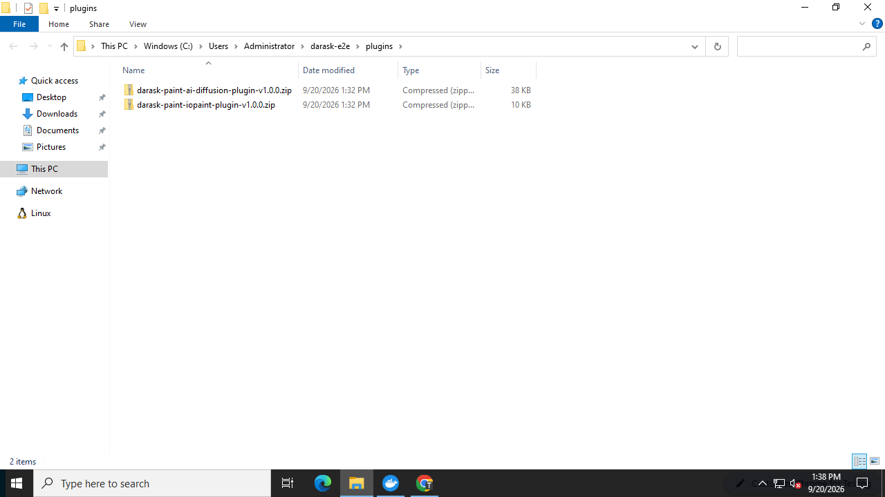
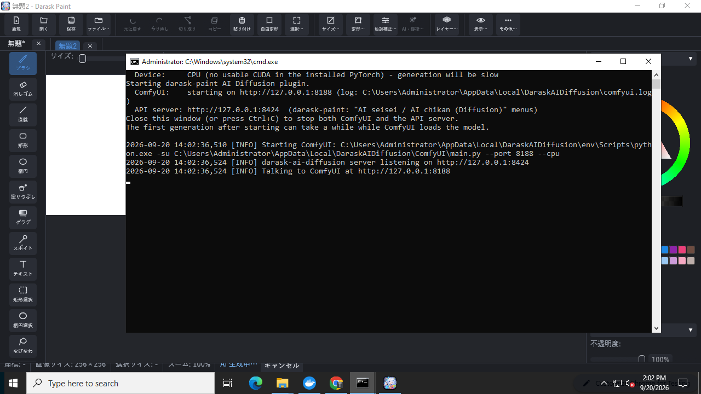
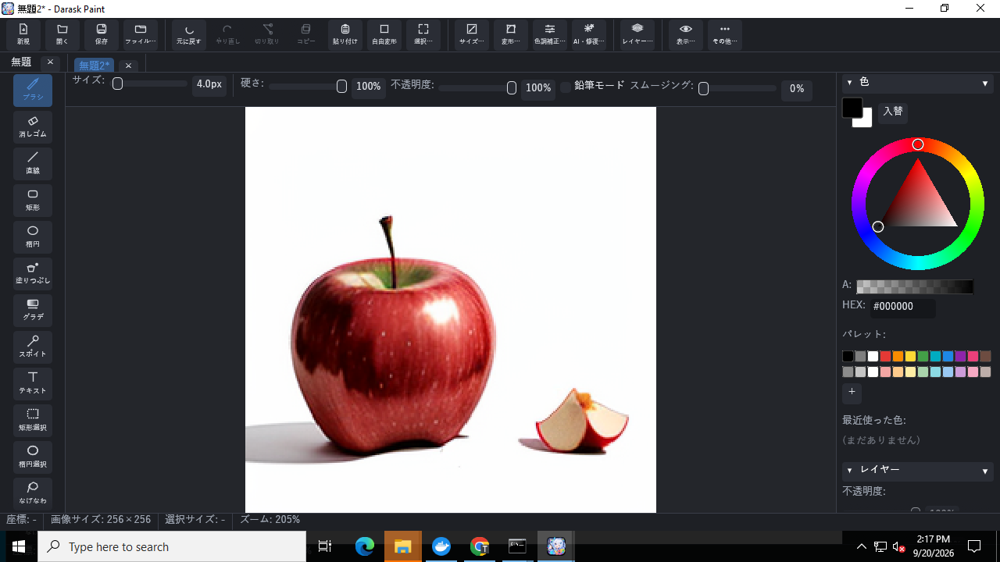

# darask-paint-ai-diffusion — Darask Paint 用 AI 生成・置換プラグイン

[Darask Paint](https://github.com/daraskme/darask-paint) の
「AI 生成(Diffusion)…」「AI 置換(Diffusion)…」メニューから使う、
ローカル AI 画像生成サーバのプラグインリポジトリです。

このリポジトリは [Acly/krita-ai-diffusion](https://github.com/Acly/krita-ai-diffusion)
(Krita 用の生成 AI プラグイン、**GPL-3.0**)のフォークです。Krita 本体・Qt に依存する
UI 部分はそのままに、Krita/Qt に依存しないヘッドレス API サーバ `darask_server.py` を
追加しています。エンジンは [ComfyUI](https://github.com/comfyanonymous/ComfyUI) を
ローカルで動かして使います。

## 何ができるか

- **AI 生成(Diffusion)…**: プロンプト(+任意でネガティブ・シード)を入力すると、
  生成結果が**新規レイヤー**として追加されます。サイズは選択範囲があればそのサイズ、
  なければキャンバス全体のサイズになります。
- **AI 置換(Diffusion)…**: 選択範囲が必須です。プロンプト+強さを指定すると、
  選択範囲だけを AI 生成結果で置き換えます(元の透明度は保持され、選択範囲外は
  変更されません)。

「AI 修復(IOpaint)」(`daraskme/darask-paint-iopaint`)が**消す**プラグインなのに対し、
こちらは**描く**プラグインです。両者は独立に導入・起動・利用できます。

## 仕組み

```
Darask Paint (Rust, 単一exe)
   │  プロンプト・選択範囲の画像/マスク (HTTP, 127.0.0.1:8424 限定)
   ▼
darask-plugin.bat → darask_server.py (Python 標準ライブラリのみ)
   │  ComfyUI の HTTP API (127.0.0.1:8188) にワークフロー JSON を送信
   ▼
ComfyUI (Python, PyTorch, ローカル管理インストール)
   │  生成/置換済み PNG
   ▼
Darask Paint が新規レイヤーとして追加、または選択範囲だけに書き戻し(1 回の元に戻す単位)
```

Darask Paint 本体は依存を増やさず高速起動のまま。AI はこのプラグインを起動した
ときだけ使えます(未導入・未起動でも本体は完全に動作します)。

`darask_server.py` はこのプラグイン専用の **ComfyUI インスタンスを 1 つだけ**
起動・占有する前提で作られています(他のアプリや別の darask-plugin.bat インスタンスと
共有しないでください)。タイムアウト時のジョブ中断は ComfyUI のグローバルな
`/interrupt`(=「今実行中のジョブを止める」)を使っており、これは固定コミットの
ComfyUI がプロンプト ID 指定の中断 API を持たないためです。専用インスタンス前提
であれば「今実行中のジョブ=自分が投げたジョブ」なので問題ありませんが、同じ
ComfyUI を他のクライアントと共有する構成には対応していません。

`darask_server.py` は Python 標準ライブラリのみで動く単一ファイルの HTTP サーバです。
Krita 本体やこのフォークの Qt 依存コード(`ai_diffusion` パッケージ)は一切 import
しません — ComfyUI の HTTP API を直接叩き、生成・インペイントのワークフロー
(ノードグラフ)JSON を自前で組み立てています(理由は本リポジトリへの実装レポートを
参照。要約: このフォークの `ai_diffusion/backend` は名前こそ Krita 非依存に見えますが、
実際には通信層が Qt の `QNetworkAccessManager` に、非同期処理が Qt のイベントループに
それぞれ依存しており、Qt を使わない独立イベントループという要件と両立しないため)。

## 動作要件

| 環境 | 目安 |
|---|---|
| NVIDIA GPU (VRAM 6GB+) 推奨 | 1 枚あたり数秒〜十数秒 |
| CPU のみ | 動作するが非常に遅い(1 枚あたり数分) |
| ディスク・通信量 | 初回セットアップで PyTorch(CUDA 版で約 3GB)+ ComfyUI 本体・依存関係
(数百MB)+ デフォルトモデル(約 2GB)を合計すると、**CUDA 版で 5〜8GB 程度**の
ダウンロードが必要です(CPU 版 PyTorch は 1GB 程度と小さいですが、生成が非常に遅くなります)。 |

## 導入手順(推奨: zip を置くだけ)

1. [Releases](https://github.com/daraskme/darask-paint-ai-diffusion/releases) の
   `plugin-vX.Y.Z` から `darask-paint-ai-diffusion-plugin-vX.Y.Z.zip` をダウンロードします
   (`v1.x` の Release は upstream の Krita プラグインです)。
2. `darask-paint.exe` と同じ階層に `plugins` フォルダを作り、zip を**そのまま**置きます
   (展開不要。設定ダイアログ(Ctrl+K)の「プラグインフォルダ」で別の場所を指定することもできます)。
   ```
   darask-paint.exe
   plugins\
     darask-paint-ai-diffusion-plugin-v1.0.0.zip
   ```
3. Darask Paint のメニューから「**AI 生成(Diffusion)…**」または
   「**AI 置換(Diffusion)…**」(置換は選択範囲が必要)を実行します。
   - 本体が zip を `plugins\darask-paint-ai-diffusion-plugin-v1.0.0\` に展開し、
     `darask-plugin.bat` を新しいコンソール窓で起動して、API サーバが応答するまで
     (最大 2 分)待ちます。
   - 初回は下記「手動導入」のセットアップ(数分〜数十分)が走るため 2 分を超えます。
     「起動中」のメッセージが出たら、コンソールでモデルダウンロードの確認に答え、
     セットアップ完了後にもう一度メニューを実行してください。
   - zip を新しいバージョンに差し替えると、次回実行時に自動で再展開されます。
4. プラグインの黒い(コンソール)ウィンドウを閉じると ComfyUI・API サーバの両方が
   停止します。

### 動作例(Windows, CPU のみ)

| `plugins` フォルダに zip を置く | 起動後のコンソール(CUDA 無し → ComfyUI を `--cpu` で起動) |
|---|---|
|  |  |

| 「AI 生成」の結果(CPU, 256×256, 20 steps, 約 150 秒) |
|---|
|  |

CPU では 256×256 / 20 steps で 3 分程度かかります(Darask Paint 0.13 は生成応答を最大 600 秒
待ちます)。

zip を自分で作る場合は `pwsh ./scripts/package_darask_plugin.ps1 -Version plugin-vX.Y.Z`
を実行します(`plugin-v*` タグを push すると GitHub Actions が同じ zip を Release に
添付します)。zip には `darask-plugin.bat` / `darask-plugin.json` / `darask_server.py`
だけが入っており、ComfyUI 等は初回起動時に固定バージョンでインストールされます。

## 導入手順(手動: クローンして起動)

1. このリポジトリをクローンします(サブモジュールは不要です)。
   ```
   git clone https://github.com/daraskme/darask-paint-ai-diffusion
   ```
   `darask_server.py` はこのフォークの Krita 用コード(`ai_diffusion` パッケージ)を
   一切 import しないため、`ai_diffusion/websockets` や `ai_diffusion/debugpy` の
   git submodule は初期化不要です(このフォークを Krita プラグインとしても使う
   場合のみ、CONTRIBUTING.md の手順で別途初期化してください)。
2. `darask-plugin.bat` をダブルクリックします。
   - 初回のみ: uv の導入 → Python 環境作成 → PyTorch(バージョン固定。NVIDIA GPU が
     あれば CUDA 12.8、なければ CPU)→ ComfyUI 本体のダウンロード(コミット固定)→
     ComfyUI の依存関係インストール、という順で進みます(数分〜数十分、回線速度に
     依存)。
   - 続けてデフォルトモデル(DreamShaper, SD1.5, 約 2GB、Hugging Face 上の特定
     リビジョンに固定)をダウンロードするか確認メッセージが表示されます。
     ダウンロードしない場合は、後で自分の好きなチェックポイントを
     `%LOCALAPPDATA%\DaraskAIDiffusion\ComfyUI\models\checkpoints` に置いてください。
     モデルは `.part` 拡張子でダウンロードし、成功した場合のみ最終ファイル名に
     リネームします(通信断で不完全なモデルファイルが「導入済み」と誤認されることを防止)。
   - 環境はすべて `%LOCALAPPDATA%\DaraskAIDiffusion` の下に作られ、他の ComfyUI /
     Krita インストールとは独立しています。セットアップが最後まで成功した場合のみ
     完了マーカー(`.darask_setup`。ComfyUI のコミット・PyTorch/torchvision の
     バージョン・requirements.txt のハッシュを記録)が書き込まれ、次回以降は
     マーカーの内容が現在のスクリプトの期待値と完全に一致する場合のみセットアップを
     スキップします(フォルダの有無だけでは判定しません)。
3. 以降は `darask-plugin.bat` を実行するとすぐに ComfyUI + API サーバが起動します。
4. Darask Paint 側で、設定ダイアログ(Ctrl+K)の `plugin_diffusion_port` が
   `8424`(既定値)になっていることを確認します。
5. Darask Paint のメニューから「**AI 生成(Diffusion)…**」または
   「**AI 置換(Diffusion)…**」(置換は選択範囲が必要)を実行します。
6. プラグインの黒い(コンソール)ウィンドウを閉じるか Ctrl+C を押すと、
   ComfyUI・API サーバの両方が停止します(Darask Paint 本体はプラグインなしでも
   全機能動作します)。

## API(darask-paint 本体の実装者向け)

- `GET /api/v1/health` → `{"plugin": "darask-ai-diffusion", "api": 1, "engine": "...", "backend": "ready|starting|error", "model": "<checkpoint名> | null", "detail": "<診断文字列> | 省略"}`
  (`detail` は `backend` が `error` のときだけ付く追加フィールドです。未知のキーは
  無視して構いません。)
- `POST /api/v1/generate` `{"prompt": str, "negative": str?, "width": int, "height": int, "seed": int?}`
  → 成功時は生の PNG バイト(`Content-Type: image/png`)、**リクエストした
  width/height と厳密に同じサイズ**で返ります。width/height は **1〜8192 の任意の値**
  (8 の倍数である必要はありません)。サーバ内部で右・下方向に 8 の倍数までパディングして
  ComfyUI に渡し、結果を元のサイズへクロップしてから返しています。
- `POST /api/v1/inpaint` `{"image": base64 PNG, "mask": base64 PNG(白=置換), "prompt": str, "negative": str?, "strength": float?(既定 1.0, 範囲 (0, 1])}`
  → 成功時は生の PNG バイト、**image と同じサイズ**で返ります。image/mask は
  同一サイズであれば任意のサイズ(1〜8192)で構いません(generate と同様に内部で
  パディング・クロップします)。
- 使用するチェックポイントは `darask-plugin.bat`/`darask_server.py` の
  `--checkpoint <ファイル名>` で明示指定できます。省略時は ComfyUI に導入済みの
  チェックポイントを**ファイル名のソート順で並べた先頭**を自動選択します。
  `--checkpoint` を指定していて該当ファイルが見つからない場合、health は
  `backend: "error"` を返します(自動フォールバックはしません)。
- リクエストの JSON は `Content-Type: application/json` 必須。`Host` ヘッダは
  `127.0.0.1:<port>` または `localhost:<port>` のみ許可、`Origin` ヘッダ付き・
  `Sec-Fetch-Site: cross-site` の要求は拒否します(ブラウザ経由の悪用対策。
  darask-paint 本体からの通常の HTTP クライアントアクセスには影響しません)。
- エラー時は常に `{"error": "..."}` の JSON。ステータスコードの分類:
  - **400**: リクエストの内容が不正(必須項目欠落・型不正・サイズ超過・
    NaN/Infinity 等)。
  - **403 / 415**: 上記のブラウザ対策・Content-Type 不一致。
  - **502**: ComfyUI との通信エラー・ComfyUI からの応答が不正/想定外
    (JSON 壊れ・画像サイズ不一致・ワークフロー拒否等)。
  - **503**: ComfyUI が未準備・チェックポイント未導入・他のジョブ実行中でビジー
    (**1 秒待って空いていなければ即座に 503** — 同時実行の待ち合わせは
    darask-paint 本体側の single-flight 制御に委ねています)・全体のタイムアウト
    超過。

詳細な挙動・既知の制限は実装レポートを参照してください。

## ライセンス

GPL-3.0(フォーク元 [Acly/krita-ai-diffusion](https://github.com/Acly/krita-ai-diffusion)
に準拠。`LICENSE` 参照)。エンジンの [ComfyUI](https://github.com/comfyanonymous/ComfyUI)
は GPL-3.0、デフォルトでダウンロードするモデルはそれぞれの配布元のライセンスに従います。
